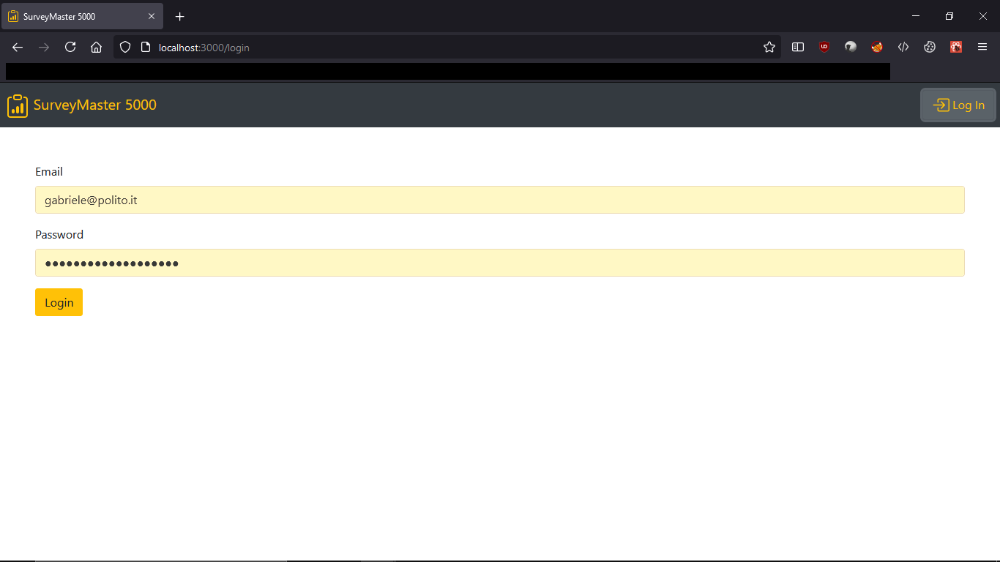

# Exam #1: "Questionario"
## Student: ***REMOVED*** ***REMOVED*** ***REMOVED*** 

## React Client Application Routes

- Route `/`: homepage. When a user is not authenticated all the surveys are shown, otherwise only admin's surveys are. It shows buttons to fill or view the surveys based on authentication.
- Route `/login`: page that allows admins to authenticate. If already logged in will redirect to `/`.
- Route `/add`: contains a list of questions that an admin can add, remove or sort based on his desire. Question types and specifications can also be set here. If the user is not authenticated and tries to access this route will be redirected to `/login`
- Route `/fill`: allows unauthenticated users to fill in a survey by showing them a list of forms corresponding to the questions of the survey. Available only when not logged in, will redirect to `/` if the user is authenticated. Trying to reach this route directly (without having clicked the button to answer a certain survey) will also redirect to `/`.
- Route `/fill`: allows admins to view all the answers of a given survey by showing them a list of read only forms with the answers given by the users, allows also to navigate between users. Available only not logged in, will redirect to `/` if the user is not authenticated. Trying to reach this route directly (without having clicked the button to view a certain survey) will also redirect to `/`.

## API Server

### *RETREIVE DATA*
- GET /api/surveys
  - parameters: none
  - list of survey objects as JSON, as an example:
  ```
  [
    {
      "id": 1,
      "nAnswers": 1,
      "title": "Informazioni personali",
      "questions": [ ... ]
    },
    {
      "id": 2,
      "nAnswers": 2,
      "title": "Carriera scolastica",
      "questions": [ ... ]
    },
    {
      "id": 3,
      "nAnswers": 1,
      "title": "Questionario valutazione Servizio SurveyMaster 5000",
      "questions": [ ... ]
    }
  ]
  ```
- GET /api/surveys/:id
  - parameters: id, non negative integer that corresponds with survey(id) in the database (no authentication is needed since all the surveys must be available to all users).
  - response: single survey object as JSON, as an example:
  ```
  {
    "id": 1,
    "nAnswers": 1,
    "title": "Informazioni personali",
    "questions": [ ... ]
  }
  ```
- GET /api/surveys/:id/answers
  - parameters: id, non negative integer that corresponds with survey(id) in the database. Must be authenticated and authorized to see the answers (only answers of admin's surveys can be obtained).
  - response: list of answers to the survey, as an example:
  ```
  [
    {
      "userName": "Non ***REMOVED***",
      "answers": [
        [
          "*elenco di istituti scolastici*"
        ],
        [
          "Sì"
        ],
        [
          "196",
          "14*14"
        ],
        [
          "Ciao! Come ti chiami?"
        ]
      ]
    },
    {
      ...
    }
  ]
  ```
- GET /api/sessions/current
  - parameters: none
  - response: data of the user (if authenticated, error otherwise), example:
  ```
  {
    "id": 1,
    "username": "***REMOVED***@polito.it",
    "name": "***REMOVED***"
  }
  ```

### *CREATE DATA*
- POST /api/surveys
  - parameters (JSON body, request must have `Content-Type: 'application/json'` header):
    - `title`: title of the survey
    - `questions`: serialized (through JSON.stringify()) array of question objects (described in the database section)
  - response: message containing survey id in case of success, error in case of failure.

- POST /api/answers
  - parameters (JSON body, request must have `Content-Type: 'application/json'` header):
    - `surveyId`: identifier of the survey answered
    - `userName`: name of the user answering the survey
    - `answers`: serialized (through JSON.stringify()) array of arrays of strings (more details in the database section)
  - response: message containing answer id in case of success, error in case of failure.

- POST /api/sessions
  - parameters (JSON body, request must have `Content-Type: 'application/json'` header):
    - `username`: email of the admin
    - `password`: password of the admin
  - response: data of the user (if authenticated, error otherwise), example:
  ```
  {
    "id": 1,
    "username": "***REMOVED***@polito.it",
    "name": "***REMOVED***"
  }
  ```

### *DELETE DATA*

- DELETE /api/surveys/:id
  - parameters: id, non negative integer that corresponds with survey(id) in the database (authentication and authorization are needed).
  - response: message containing survey id in case of success, error in case of failure.

- DELETE /api/sessions/current
  - parameters: none
  - response: empty, only status

## Database Tables

- Table `admins` - contains id(INTEGER), email(TEXT), name(TEXT), hash(TEXT)
- Table `surveys` - contains id(INTEGER), admin(INTEGER), title(TEXT), questions(TEXT), nAnswers(INTEGER)
- Table `answers` - contains id(INTEGER), surveyId(INTEGER), answers(TEXT), userName(TEXT)

Notes: 
- All the ids are used as primary keys with attribute AUTOINCREMENT so that it is not needed to handle it server-side
- answers(surveyId) is an external key derived from surveys(id), it is set as ON DELETE CASCADE so that when a survey is deleted all its answers are deleted too
- surveys(nAnswers) is updated upon insertion of a new answer through a trigger so that server does not have to handle it, trigger has been created with following SQL code:
```
CREATE TRIGGER SURVEY_NANSWER 
   AFTER INSERT
   ON answers
BEGIN
 UPDATE surveys
 SET nAnswers = nAnswers+1
WHERE
   id = NEW.surveyId;
END
```

- It is also important to notice that answers(answers) and surveys(questions) are JavaScript objects which are serialized/deserialized through the utilities JSON.stringify()/JSON.parse().
- Specifically their properties are:
  - question (survey(questions) is a serialized array of question objects):
    - `type`: "OPEN"/"CLOSE", a constant string representing the question type (open answer or multiple choice)
    - `question`: string indicating the question itself
    - `min`: minimum number of answers (if min == 0 the question is optional), min must be non negative integer
    - `max`: maximum number of answers, max must be non negative integer <= nAnswers if type is "CLOSE", otherwise is set as 1 and carries no actual meaning
    - `nAnswers`: total number of possible answers, nAnswers must be non negative integer <= 10, if type is "CLOSE", otherwise is set as 1 as open answers can only have one answer, always equal to the length of the answers array
    - `answers`: array containing at max nAnswers string, representing the possible answers if type is "CLOSE", otherwise contains only one empty string (carries no meaning but used for consistency).

  - answer (object that represents all the answers of a user to a survey):
    - `userName`: non-empty string containing the username of the answerer
    - `answers`: array containing N arrays of strings, where N is the number of questions of the corresponding survey. Internal arrays may be empty if question was optional, contain only one string in case question was of type "OPEN" or multiple strings in case was of type "CLOSE" with max > 1.


## Main React Components

- `LoginForm` (in `components/LoginForm.js`): the login page, containing a form for admin email and passwords, implements login functionality by requesting verification of credentials to the server.
- `MyNavbar` (in `components/MyNavbar.js`): navbar available in all the sections of the application, allows navigation to / by clicking the brand or login/logout through the dedicated button.
- `SurveyList` (in `components/SurveyList.js`): table listing all the surveys and a button to answer it for each one of them (if user is not authenticated) or a list of the surveys published by the admin with the number of answers (if anyone answered) and a button to view the answers for each one instead of the button to fill in the survey, also a button to add a survey is present (this last content of the table is available only after authentication).
- `SurveyAdd` (in `components/SurveyAdd.js`): container for a list of `QuestionBuilder` components (described later), also contains a form for the survey title and buttons to Publish/Cancel the publication. It handles the states of the whole survey (and its errors) and the submission/client validation of it.
- `QuestionBuilder` (in `components/QuestionBuilder.js`): an adapted React Toast that incorporates multiple forms to build/define a question and its properties, questions can also be moved up/down thanks to the dedicated buttons.
- `SurveyFill` (in `components/SurveyFill.js`): container for a list of `QuestionViewer` components (described later) without the `readOnly` property, also contains a form for the user name and buttons to Submit/Cancel the answering process. Renders (with the component mentioned before) all the questions of the survey given through location and allows the user to fill in them. It handles the states of the answers (and their errors) and the submission/client validation of them.
- `SurveyView` (in `components/SurveyView.js`): container for a list of `QuestionViewer` components (described later) with the `readOnly` property set as true. It fetches from the server the answers of a survey passed with the location and renders them as read-only, reusing the previously mentioned component. Allowes for navigation between answers of different users thanks to the dedicated buttons and dropdown and shows the username with a random header phrase. A button at the bottom allows the admin to return back to home.
- `RandomHeader` (in `components/RandomHeader.js`): an header for the SurveyView component generated by picking a random sentence from a list and formatting the username inside.
- `QuestionViewer` (in `components/QuestionViewer.js`): an adapted React Toast that incorporates multiple forms to render questions of a survey, based on the min/max parameters and the type can render as text area, radio buttons or group of checkboxes. It is also possible to render it in read only mode, which won't allow the admin to modify and submit the answers given by a user but only view them.

## Screenshots


*Homepage when a user is not authenticated. It lists all the available surveys and shows buttons to fill them.*


*Homepage when admin is logged in, his surveys are listed and answers can be viewed, a button to add new survey is available.*


*Answers to a certain survey are listed, showing a view for each user, is it possible to switch user both with the dropdown menu or the arrow buttons.*


*Page to create a survey, multiple questions can be added and type, as well as constraints can be specified, error messages will appear when submitting invalid questions*


*When the user is not authenticated this view is shown after selecting a survey to fill in. If the users tries to submit invalid answers error messages are shown, indicatind which answer is not valid and why.*


*A simple login page asking the admin for his credentials.*


*This loading alert will be shown each time the application is fetching data from the server. (Its duration is longer than the actual loading time so we avoid brief flashing on the screen).*

## Users Credentials

- SurveyAdmin, login with email: admin@surveymaster.com password: password
- ***REMOVED***, login with email: ***REMOVED***@polito.it password: passwordmoltosicura
